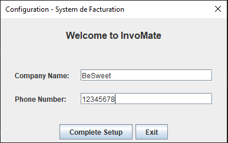
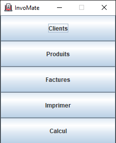
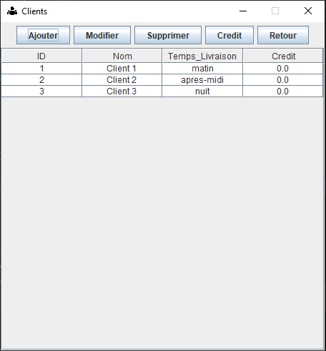
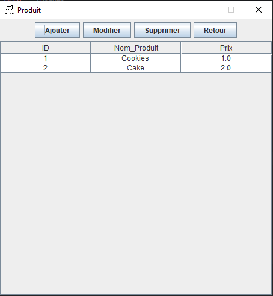
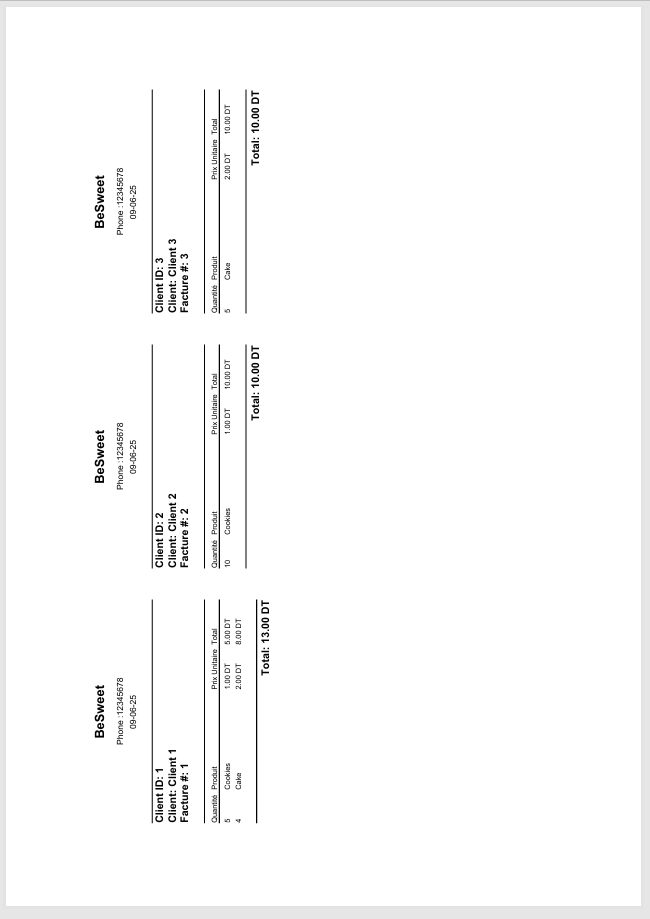
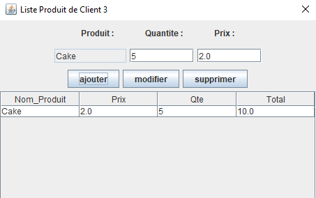
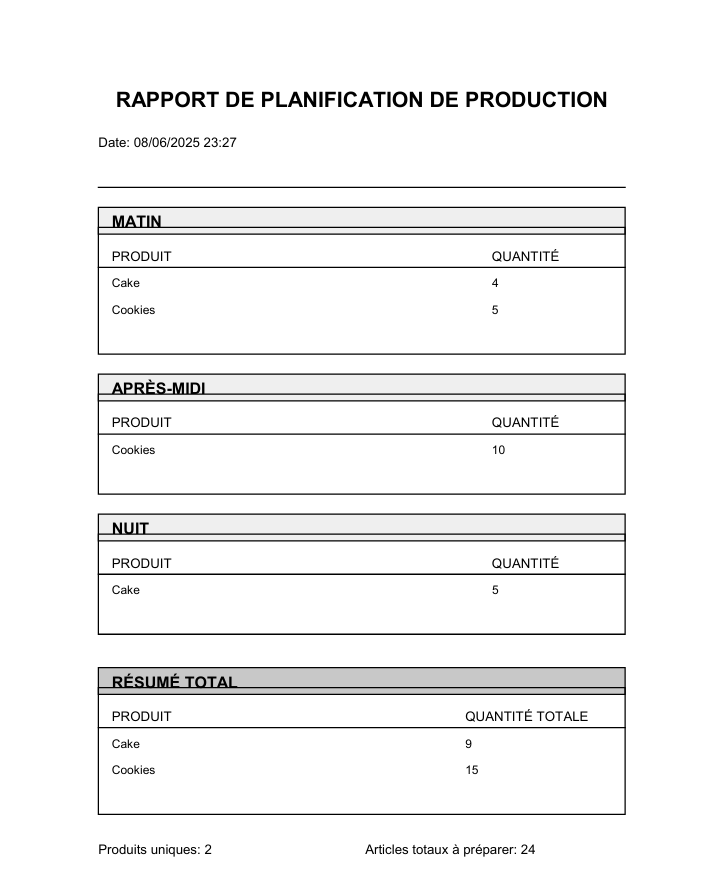

# 🧾 InvoMate – Smart Invoicing & Planning for Small Businesses

**InvoMate** is a desktop Java application that helps small business owners (like bakery shops, local producers, or delivery-based services) easily manage their clients, products, and invoices — with additional support for product planning reports.

---

## ✨ Features

### 👤 Client Management
- Add, edit, and delete clients.
- Track **delivery time** and **client debt** (amount owed).

### 📦 Product Management
- Add, edit, and delete products.

### 🧾 Invoice Handling
- Create, modify, and delete invoices.
- Add products to each invoice.
- Include **order notes** and adjust **delivery time**.
- Export invoices to **PDF**.
- Each **A4 page contains 3 invoices** for efficient printing.

### 📊 Product Planning Report (PDF)
Generate a **planning report** that helps the business owner (e.g., a baker) prepare orders efficiently:
- Calculates how many products (e.g., cookies, cakes) are needed **per delivery time**.
- Displays a **total count of each product** required.
- Can be **saved as PDF** or printed.

---

## 🖥️ Tech Stack

- **Language:** Java
- **GUI:** Java Swing
- **Database:** SQLite (embedded)
- **Build Tool:** Maven

---

## 📸 Screenshots
## 🖼️ First Time Configuration


## 🖼️ Home Preview


## 🖼️ Clients Preview


## 🖼️ Products Preview


## 🖼️ Invoices Preview


## 🖼️ Invoice Items Preview


## 🖼️ Invoice Preview


## 🖼️ Report Preview



---

## 📂 Getting Started

### Build & Run
📌 First-Time Configuration (Windows)
When the application is run for the first time on Windows, it will automatically generate:

📁 Database file:
C:\Users\YourUser\AppData\Roaming\

⚙️ Configuration file:
C:\Users\YourUser\AppData\Roaming\Project\config.properties

These files store your company name, phone number, and local client/product data.

🛠️ Customization & Migration
To change your company name or phone number, edit the config.properties file.

To move your data to another computer, copy both the database file and the config file to the same paths on the new machine.

```bash
git clone https://github.com/Ruthless30/InvoMate.git
cd InvoMate
mvn clean package
java -jar target/InvoMate.jar
